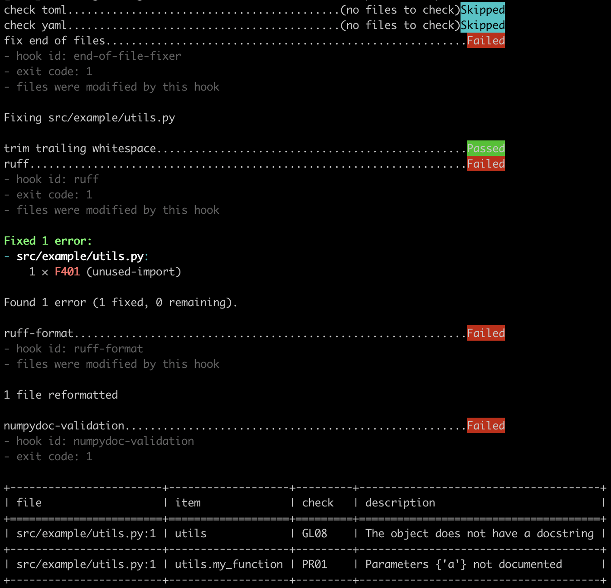
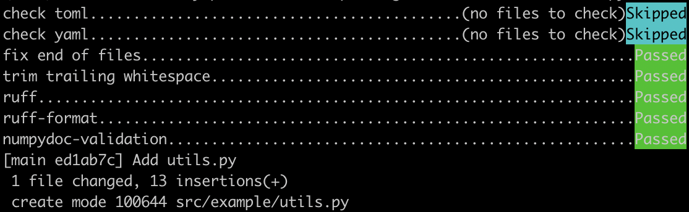

# Example of Using Pre-Commit Hooks
Example repository for article on setting up pre-commit hooks.

## Requirements
Python >= 3.8

## Setup
**NOTE**: If you choose to use GitHub Codespaces with this repository, you can skip ahead to step 4.

1. Clone this repository and change to the directory for this repository:

    ```shell
    git clone git@github.com:stefmolin/pre-commit-example.git && \
        cd pre-commit-example;
    ```

2. Create a virtual environment:

    ```shell
    python -m venv venv
    ```

3. Activate the virtual environment:

    ```shell
    # bash/zsh
    source venv/bin/activate

    # Windows cmd.exe
    .\venv\Scripts\activate.bat
    ```

4. Install the package (update `pip` if you encounter errors):

    ```shell
    python -m pip install -e .
    ```

5. Install the pre-commit hooks in this repository:

    ```shell
    pre-commit install
    ```

6. Create the file `src/example/utils.py` as follows and save it:

    ```python
    import re

    def my_function(a):
        """My function."""
        pass
    ```

7. Try to commit this file:

    ```shell
    git add src/example/utils.py
    git commit -m "Add utils.py"
    ```

    The pre-commit hooks will run, and your commit will be stopped since there are some violations:

    

8. Fix those issues (example below) and then try to commit again.

    ```python
    """Utility functions."""


    def my_function(a):
        """
        My function.

        Parameters
        ----------
        a : int
            The value to use.
        """
        pass

    ```

    If you fixed everything, your commit will be successful:

    

For an explanation of the setup, please consult the accompanying article (TBD).

---
## About the Author

Stefanie Molin ([@stefmolin](https://github.com/stefmolin)) is a software engineer and data scientist at Bloomberg in New York City, where she tackles tough problems in information security, particularly those revolving around data wrangling/visualization, building tools for gathering data, and knowledge sharing. She is also the author of [Hands-On Data Analysis with Pandas](https://www.amazon.com/dp/1800563450/), which is currently in its second edition and has been translated into Korean. She holds a bachelor’s of science degree in operations research from Columbia University's Fu Foundation School of Engineering and Applied Science, as well as a master’s degree in computer science, with a specialization in machine learning, from Georgia Tech. In her free time, she enjoys traveling the world, inventing new recipes, and learning new languages spoken among both people and computers.
